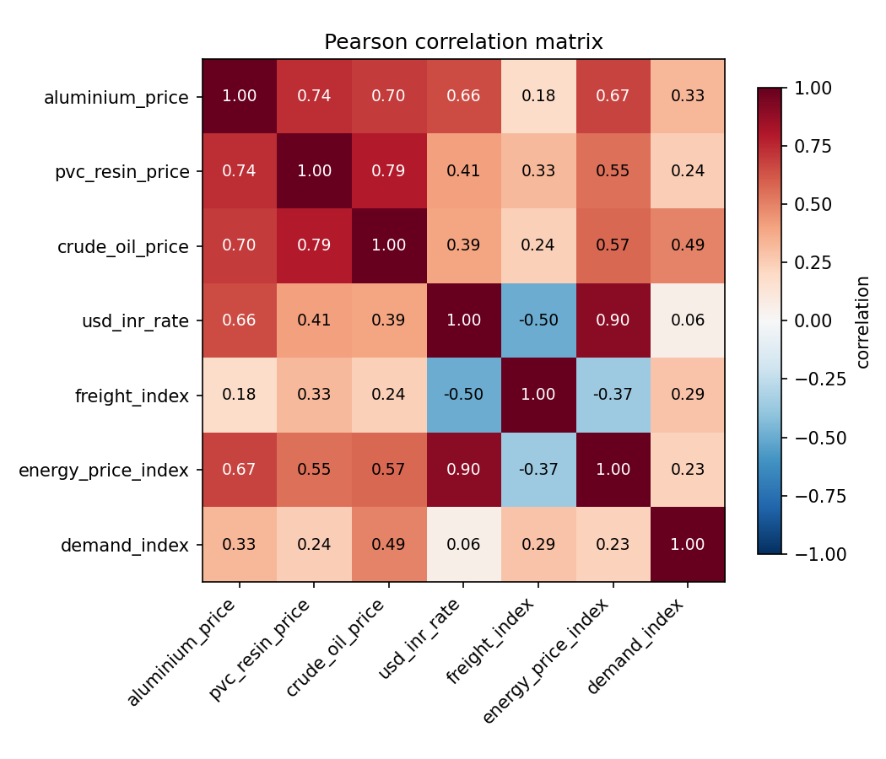
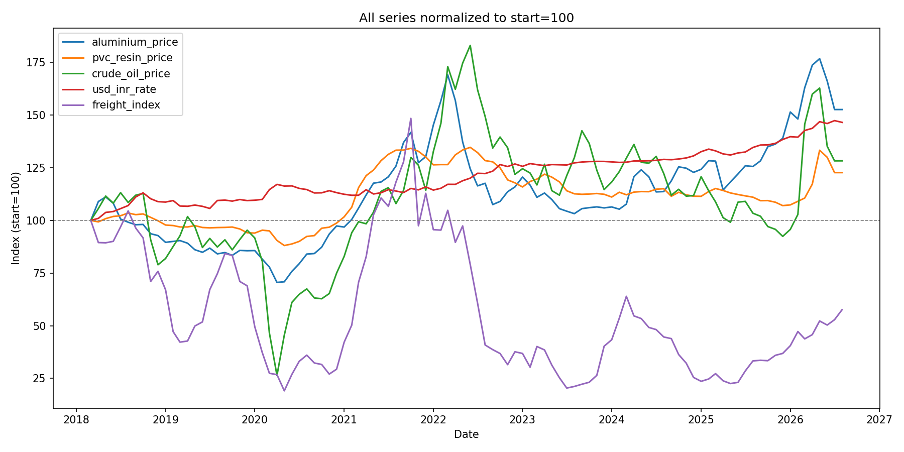
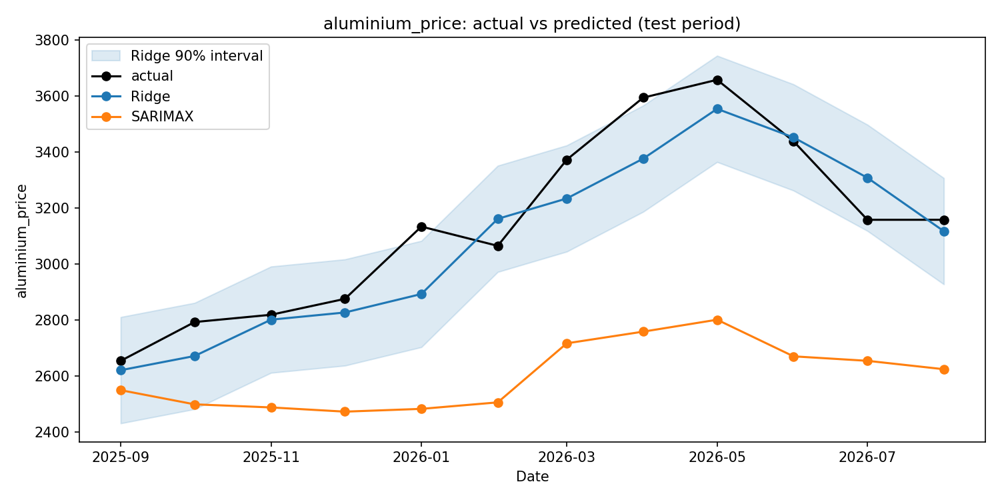
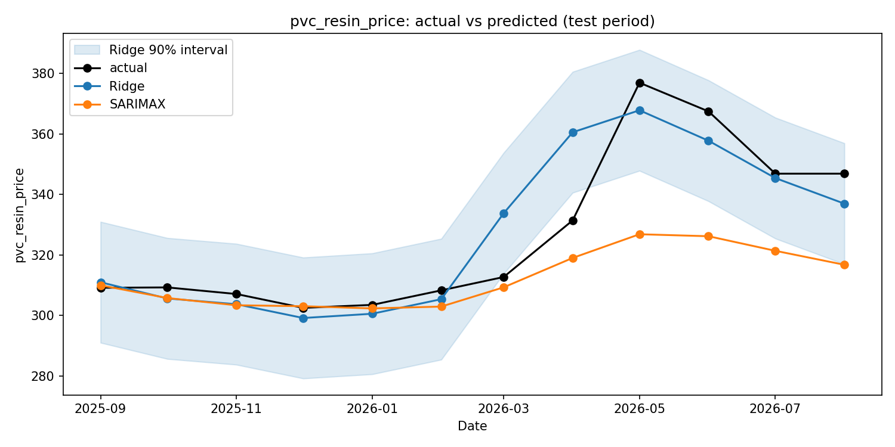

# ACG Smart Buy

## Raw material intelligence for procurement decisions

ACG Smart Buy is a hackathon prototype that helps procurement teams decide
whether to **buy now, wait, or monitor** aluminium and PVC resin prices. It
combines historical price data, causal driver analysis, forecasting, and
confidence-aware procurement signals in one decision dashboard.

The project is designed around a practical question:

> What should ACG do about its next raw-material purchase, and why?

The answer is not just a predicted price. The dashboard connects each forecast
to its strongest upstream drivers, an uncertainty band, a recommendation, and
plain-English context that can be used in a purchasing conversation.

## What the demo highlights

- **Six-month forecasts** for aluminium and PVC resin prices.
- **Ridge regression evaluated against a naive persistence baseline**, using a
	time-based holdout rather than a shuffled split.
- **Causal driver graph** connecting targets to crude oil, USD/INR, energy, and
	freight. Edge weights are based on the project's measured correlations.
- **Buy / Wait / Neutral signals** that compare forecast prices with a trailing
	historical average and account for model uncertainty.
- **Prediction intervals and confidence labels** so a recommendation is not
	presented without its level of certainty.
- **What-if analysis** for exploring how crude oil and USD/INR changes could
	affect the model output.
- **Risk alerts** for unusual historical driver volatility, including the
	affected material targets.
- **Auto-generated forecast narratives** that combine price, confidence, top
	drivers, and risk context into presentation-ready text.
- **Static, camera-ready React demo** powered by a checked-in JSON snapshot,
	with no live API dependency during a pitch.

## Project visuals

### How the market signals move together



The correlation analysis is used to justify which upstream variables are
strong enough to become quantitative model inputs, while weaker relationships
can remain visible as qualitative context in the graph.



### Forecast outputs





The forecast views compare the model output with actual history and show the
uncertainty band used by the procurement decision layer.

The interactive causal graph is generated at
[`output/price_driver_graph.html`](output/price_driver_graph.html). Open it in
a browser after running the pipeline to inspect relationships and correlation
values interactively.

## How it works

```text
Raw price data
			|
			v
Correlation analysis --> causal knowledge graph --> feature selection
			|                                             |
			+--> feature engineering --> Ridge evaluation and forecasting
																										|
																										v
															intervals + confidence + procurement signal
																										|
																										v
																	React dashboard + narrative + what-if UI
```

### Modeling approach

The pipeline forecasts two targets: `aluminium_price` and `pvc_resin_price`.
Ridge regression uses standardized lagged, rolling, and exogenous features.
Aluminium also receives explicit target lags and energy features because the
project's analysis identifies aluminium as especially exposed to energy costs.

Models are evaluated using the final 12 months as a time-ordered test set.
The project reports MAE, RMSE, MAPE, and directional accuracy alongside the
naive persistence baseline. A SARIMAX comparison is also retained in the
forecasting analysis for model benchmarking.

For the six-month procurement view, known future drivers are held at their
last observed value. This is an explicit demo assumption; production use
could replace it with market forward curves or analyst scenarios.

## Run the React demo

From the repository root:

```bash
cd frontend
npm install
npm run dev
```

Open the local Vite URL shown in the terminal. The primary interface is the
React app in `frontend/`; it reads `frontend/public/data.json` and does not
require a backend server.

## Rebuild the data and outputs

Install the Python dependencies first:

```bash
pip install -r requirements.txt
```

Then run the pipeline in order:

```bash
python src/fetch_data.py
python src/correlation_analysis.py
python src/feature_engineering.py
python src/forecast_model.py
python src/procurement_signal.py
python src/risk_alerts.py
python src/narrative_generator.py
python main.py
python src/export_dashboard_data.py
```

The scripts write charts to `plots/`, decision and narrative artifacts to
`output/`, and the dashboard snapshot to `frontend/public/data.json`.

## Repository guide

| Path | Purpose |
| --- | --- |
| `data/` | Input price and engineered feature CSVs |
| `src/correlation_analysis.py` | Correlation analysis and heatmap generation |
| `src/feature_engineering.py` | Lagged, rolling, and shock features |
| `src/forecast_model.py` | Ridge, SARIMAX, naive baseline, and forecast plots |
| `src/knowledge_graph.py` | Causal relationships and model-input selection |
| `src/procurement_signal.py` | Forecast horizon, confidence, and buy/wait logic |
| `src/risk_alerts.py` | Historical driver-volatility detection |
| `src/narrative_generator.py` | Plain-English forecast explanations |
| `src/export_dashboard_data.py` | Builds the React data snapshot |
| `frontend/src/` | React dashboard and landing experience |
| `plots/` | Analysis and forecast visuals |
| `output/` | Generated tables, narratives, and graph export |

## Additional dashboard option

The original Streamlit dashboard remains available as a lightweight analysis
view:

```bash
streamlit run src/dashboard.py
```
